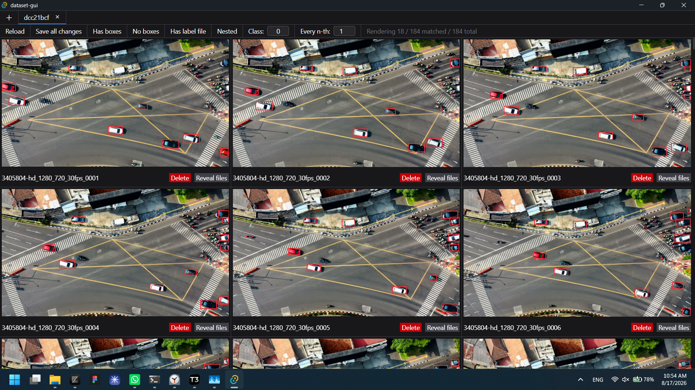
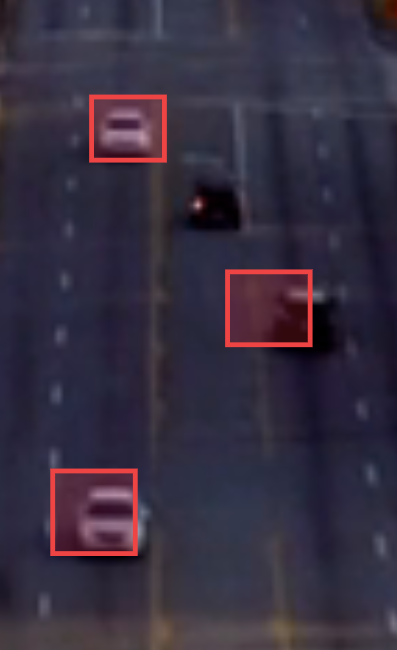
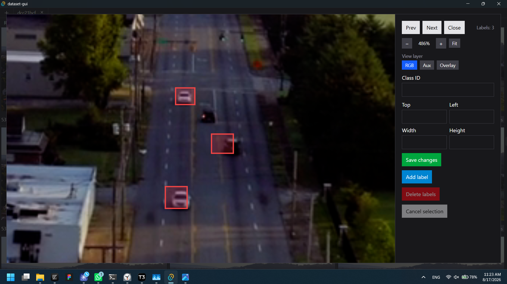
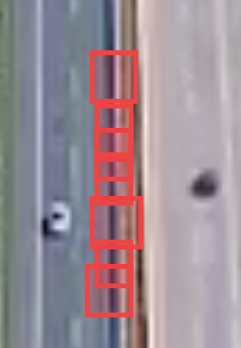
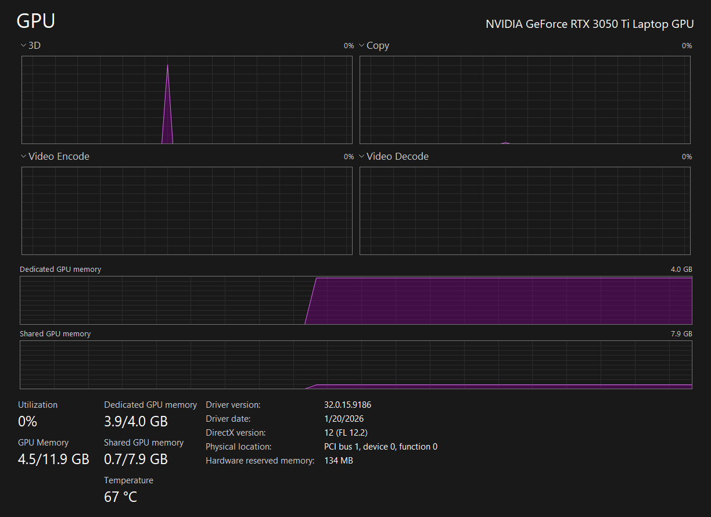

# vehicle_8h_auto_model

Vehicle model auto annotation task in 8 hours.

Pipeline:

1. Split videos into frames at around 2 FPS
2. Run Moondrea VLM to detect cars and save in YOLO format
3. Merge labels with high IoU into 1
4. Convert dataset to COCO format
5. Train PP-YOLO model on it

Run split:

```bash
uv run split_video_to_frames.py --video "./dataset/train/videos" --frames-dir "./dataset/train/frames" --fps 2
```

Run auto annotation:

```bash
uv run auto_annotate.py --frames-dir "./dataset/train/frames" --labels-dir "./dataset/train/labels" --label "vehicle"
```

Merge labels with high IoU:

```bash
uv run merge_labels.py --labels-dir "./dataset/train/labels" --frames-dir "./dataset/train/frames" --iou-threshold 0.3
```

Convert to COCO:

```bash
uv run convert_to_coco.py --labels-dir "./dataset/train/labels" --images-dir "./dataset/train/frames" --destination-dir "./dataset/coco/train" --class-names "vehicle"
```

## Speedrun marks:

| Step                                      | Time mark in 8 hours |
| ----------------------------------------- | -------------------- |
| Split into frames complete                | 20 minutes           |
| Auto annotations complete                 | 2 hours 20 minutes   |
| Functional cleanup, ready to run training | 3 hours 50 minutes   |
| First training run complete               | 5 hours 15 minutes   |

## Notes

### FOV assumptions

It's an HD video from drone, so it's an 16:9 camera, likely from Mavic. So diagonal FOV would be around 84 degree.
For a 16:9 video image, an 84° diagonal FOV corresponds approximately to: 76° horizontal × 48° vertical.

### Auto annotations

To review the dataset I use my own tool called Dataset GUI which I use to edit my datasets: 

Sometimes the Moondream 2 VLM misses a little, like this: , so I usually would clean it up by hand quickly in my editing tool: 

Moondream 3 performs better but doesn't fit on my GPU.

I am running merge of labels with reasonable IoU.
And then I am doing light editing with my tool to remove big misses.
Like this:


Unfortunately Moondream 2 didn't perform best on the high above video. Moondream 3 performs slightly better, but still does have some misses: 

One of the improvements was to take frame from far above, split it into 4 and run VLM on each and then combine boxes back into 1 big image space. That helped.

I also inflated small boxes by 10% to better contain small objects.

**NOTE**: after first training run I decided to try to do real clean up by hand to compare results, because mAP wasn't super great (but it's also because amount of data is small).

### Model

YOLO11 from Ultralytics has sh*t license, so using PP-YOLOE from paddle detection.

I picked S size, should be fast enough to train at given time. Input size was changed to 416x736px to move correspond to the videos aspect ratio. Train videos are horizontal, while Eval video is vertical so I rotated it into horizontal.

### GPU

I am bottlenecked by my GPU, but ideally you would run **Moondream 3** model instead of Moondrea 2 as it has better reasoning. Poor GPU: 

## Paddle install

```bash
cd PaddleDetection
uv venv --python 3.9 .venv

# paddle 2.6.2 GPU wheel for CUDA 12.0 (cu126 index only ships paddle 3.x on Windows)
uv pip install --python ".venv\Scripts\python.exe" paddlepaddle-gpu==2.6.2.post120 -i https://www.paddlepaddle.org.cn/packages/stable/cu120/

# provides cudnn64_8.dll (v8.9) required by the cu120 wheel; add its bin dir to PATH
uv pip install --python ".venv\Scripts\python.exe" nvidia-cudnn-cu12==8.9.7.29
uv pip install --python ".venv\Scripts\python.exe" "setuptools<81"

# verify GPU: expect "PaddlePaddle works well on 1 GPU"
.venv\Scripts\python.exe -c "import paddle; paddle.utils.run_check()"

uv pip install --python ".venv\Scripts\python.exe" -r requirements.txt
.venv\Scripts\python.exe setup.py install
uv pip install --python ".venv\Scripts\python.exe" scikit-learn "numba==0.56.4"

# sanity test: expect 7/7 OK
.venv\Scripts\python.exe ppdet/modeling/tests/test_architectures.py
```

## Model metrics

Metrics for the v1 model (`models/v1.pdparams`, same weights as `output/best_model.pdparams`), computed with `eval_metrics.py`:

```bash
python eval_metrics.py --labels-dir "vehicle_8h_auto_model/dataset/eval/labels" --bbox-json "eval_bbox/bbox.json"
```

Assumptions: pinhole distance `distance = 4.5 m (car length) × focal_px / max(box w,h)`; FOV 84° diagonal = 76°H (README "FOV assumptions"), focal = 819.2 px; IoU ≥ 0.5 matching; 61 eval frames @2fps (30.5 s clip); N_frames = 61.

Metrics definitions:

- Detection rate = TP / (TP + FN)
- Precision = TP / (TP + FP)
- False alarms / min = FP × 60 / N_frames
- Time to first detection = seconds

| Metric                  | 0–200 m         | 200–400 m |
| ----------------------- | --------------- | --------- |
| Detection rate          | 0.771 (thr 0.3) | N/A       |
| Precision               | 0.231 (thr 0.3) | N/A       |
| False alarms / min      | 419 (thr 0.3)   | N/A       |
| Time to first detection | 0.0 s (thr 0.3) | N/A       |

GT distances span 16–80 m, so all ground truth falls in the 0–200 m band; the 200–400 m band has no GT samples and is reported as N/A. A PR curve across confidence thresholds (0.1 / 0.2 / 0.3 / 0.5) is available from the script.

**Extra eval video:** [Drone footage of traffic on a highway interchange](https://www.pexels.com/video/drone-footage-of-traffic-on-a-highway-interchange-12477079/) (Pexels), downloaded to `dataset/eval/videos/12477079-hd_1280_720_30fps.mp4` (1280×720, ~30fps, 81.5 s); frames split at 2fps into `dataset/eval/frames/` (`12477079-hd_1280_720_30fps_%04d.png`, 163 frames).

| Thr | Detection rate | Precision | FA/min  | Time to first detection (s) |
| --- | -------------- | --------- | ------- | --------------------------- |
| 0.1 | 0.892          | 0.054     | 2569.18 | 0.0                         |
| 0.2 | 0.831          | 0.129     | 912.79  | 0.0                         |
| 0.3 | 0.771          | 0.231     | 419.02  | 0.0                         |
| 0.5 | 0.355          | 0.360     | 103.28  | 1.0                         |
